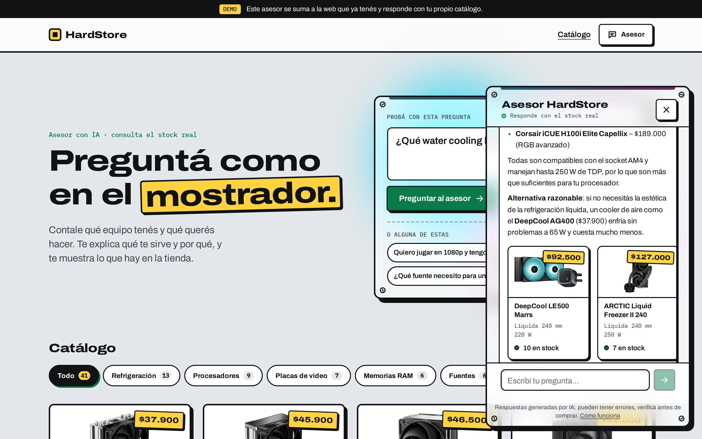
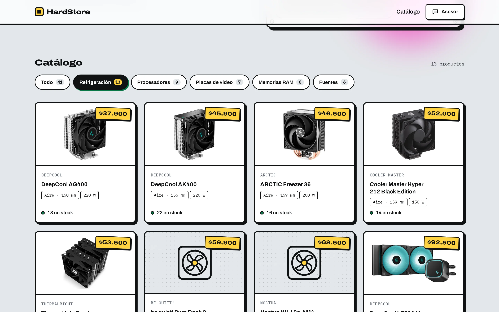
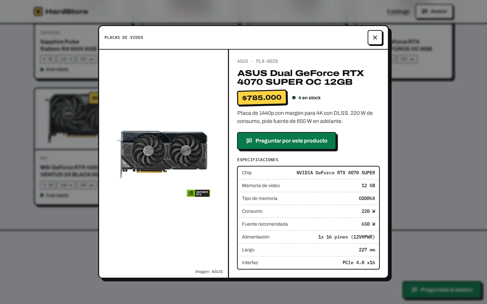
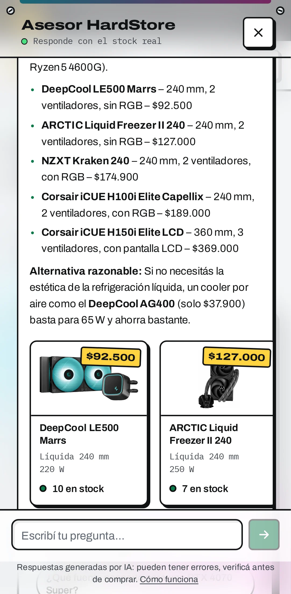

# HardStore — asesor de ventas con IA sobre un catálogo real

Un asistente que se **agrega a la web que un comercio ya tiene**. El visitante pregunta en
lenguaje natural, la IA da el criterio técnico correcto **y además** busca en el catálogo real
de la tienda y muestra los productos que encajan.

No es un chatbot de FAQ ni un buscador con filtros: el modelo deduce las specs que el cliente
nunca escribió (socket, TDP, altura del disipador) y con eso consulta la base de datos.

> **Pregunta de referencia:** «¿Qué water cooling le pongo a un Ryzen 5 4600G?»
> El asesor explica que es socket AM4 y 65 W, que no hace falta una AIO de 360 mm, que hay que
> mirar la altura y el espacio para la RAM — y muestra tres coolers compatibles que están en stock.



| Catálogo | Ficha de producto | En el celular |
|---|---|---|
|  |  |  |

---

## Cómo funciona

```
Frontend  ──POST /api/chat──▶  Backend  ──tool use──▶  Groq
                                  │                      │
                                  │   ◀── "buscá coolers AM4, TDP ≥ 65 W" ──┘
                                  ▼
                               MySQL  ──productos──▶  el modelo redacta con resultados reales
```

1. El modelo recibe la pregunta y la definición de la herramienta `buscar_productos`.
2. En vez de responder, pide una o varias búsquedas con los criterios que dedujo.
3. El backend las ejecuta contra MySQL y le devuelve los productos.
4. El modelo redacta la respuesta y cierra con los ids que recomienda; el backend los convierte
   en las tarjetas que ve el visitante.

Detalles que importan: **la API key nunca llega al navegador**, el modelo **solo puede nombrar lo
que devolvió la búsqueda**, y si algo no aparece la búsqueda se relaja sola y lo aclara, en vez de
contestar «no hay stock».

## Stack

| Capa | Tecnología |
|---|---|
| Base de datos | MySQL 8 + phpMyAdmin (Docker) |
| Backend | Node.js + Express + TypeScript |
| IA | Groq (API compatible con OpenAI), `openai/gpt-oss-120b` con respaldo |
| Frontend | React 19 + Vite, JSX y CSS propio (sin Tailwind ni librerías de componentes) |
| Pruebas | Scripts de consola + Playwright (escritorio y celular) |

## Ponerlo a andar

```bash
# 1. Base de datos
cd Backend
cp .env.example .env          # y poné tu GROQ_API_KEY (se saca gratis en console.groq.com)
docker compose up -d          # MySQL en 3307, phpMyAdmin en 8081 (root / root123)

# 2. Backend
npm install
npm run dev                   # http://localhost:3000/api

# 3. Frontend
cd ../Frontend
npm install
npm run dev                   # http://localhost:5173
```

La base se crea sola con el esquema y 41 productos reales la primera vez que levantan los
contenedores.

## Pruebas

```bash
# Backend
npm run probar:busqueda       # el buscador, sin IA
npm run probar:ia             # la pregunta de referencia contra Groq
npm run probar:chat           # conversación de varios turnos por HTTP
npm run probar:seguridad      # cabeceras, CORS, inyección SQL, errores y límites
CON_IA=1 npm run probar:seguridad   # suma los intentos de prompt injection

# Frontend
npm run test:e2e              # Playwright: catálogo, chat, legales y capturas de referencia
CON_IA=1 npm run test:e2e -- --grep @ia    # el mismo flujo, con la IA de verdad
npm run capturas              # regenera docs/capturas/
```

## Seguridad y privacidad

- La key de Groq vive solo en el `.env` del backend. Quien intercepte un pedido desde la consola
  del navegador ve `/api/chat` con la pregunta y la respuesta, nunca la key.
- Cabeceras con `helmet` (CSP cerrada, sin sniffing, sin referrer), CORS con lista blanca.
- Tres límites de uso: por IP, del chat para todo el sitio, y un cupo diario de tokens que evita
  quedarse sin cuota a mitad de una demostración.
- Consultas parametrizadas y criterios normalizados: los tests de inyección están en
  `Backend/scripts/seguridad/`.
- Del chat se guardan la pregunta, la respuesta y un id de sesión al azar. Nada personal, sin
  cookies ni analítica, y se borra a los 30 días (`npm run limpiar`).
- El sitio explica todo esto al visitante en **Sobre el demo / Privacidad / Cómo funciona la IA**,
  y el chat aclara siempre que las respuestas las genera una IA.

Antes de publicarlo: **`docs/deploy.md`** tiene la lista completa (usuario de MySQL con permisos
mínimos, phpMyAdmin fuera de producción, CSP del frontend, dominios).
Para mostrarlo o grabar un video: **`docs/demo.md`** — guion de 60 segundos y
`Frontend: npm run demo`, que graba el recorrido completo sin manos.

## Estructura

```
Backend/
  db/init/        esquema y seeds (catálogo, personas, ventas, chat)
  db/seguridad/   usuario de la app con permisos mínimos
  src/services/   productos/ (búsqueda y relajación) · ia/ (cliente, prompt, tool use)
  scripts/        pruebas por consola
Frontend/
  src/components/ catalogo/ · chat/ · legal/ · layout/ · ui/
  src/styles/     tokens, base, botones (CSS propio)
  e2e/            Playwright
docs/             capturas, deploy, guion del demo
```

Cada archivo se mantiene por debajo de ~150 líneas, con una responsabilidad por módulo.

## Créditos

Fotos de los fabricantes y de Wikimedia Commons; el crédito y la licencia están en cada ficha.
Las marcas pertenecen a sus titulares. Los precios son de referencia: HardStore es una tienda
de ejemplo, no vende nada.
